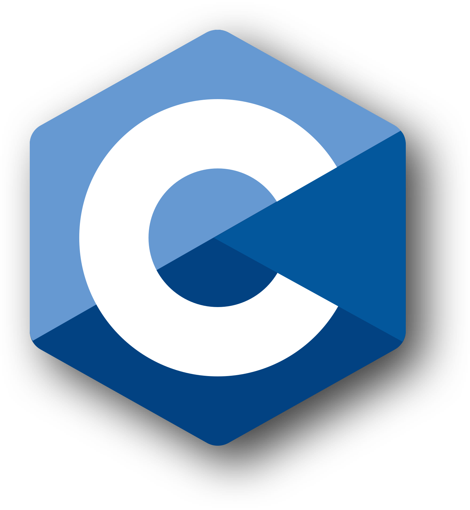
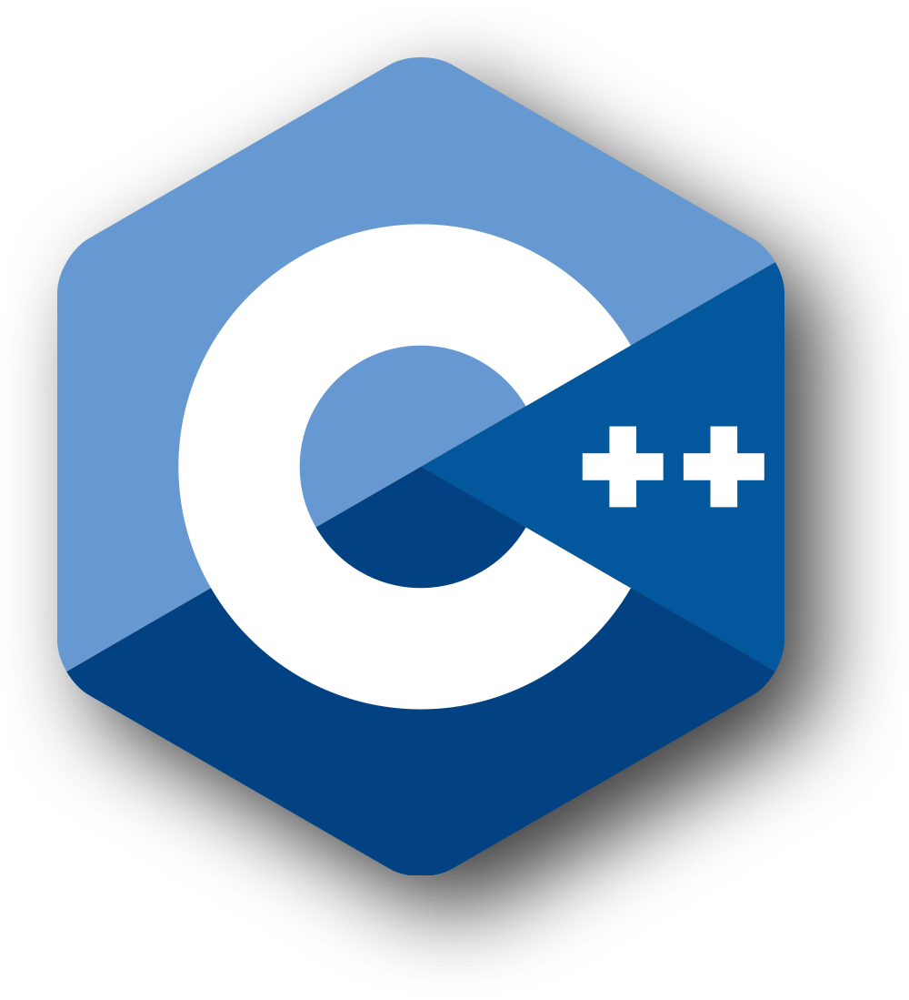
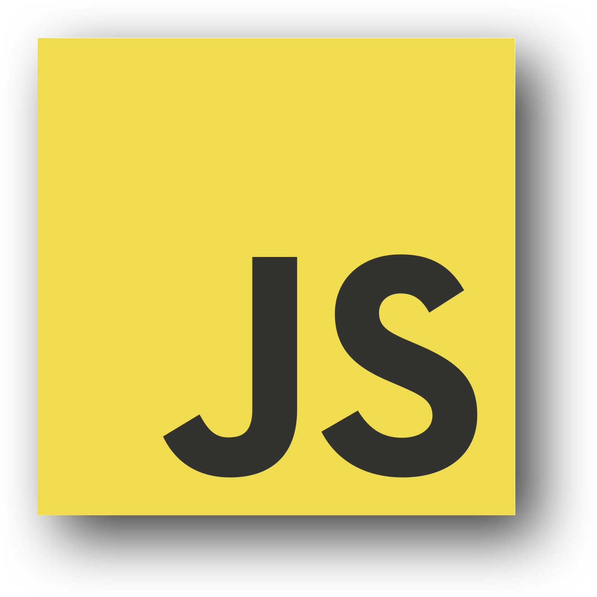
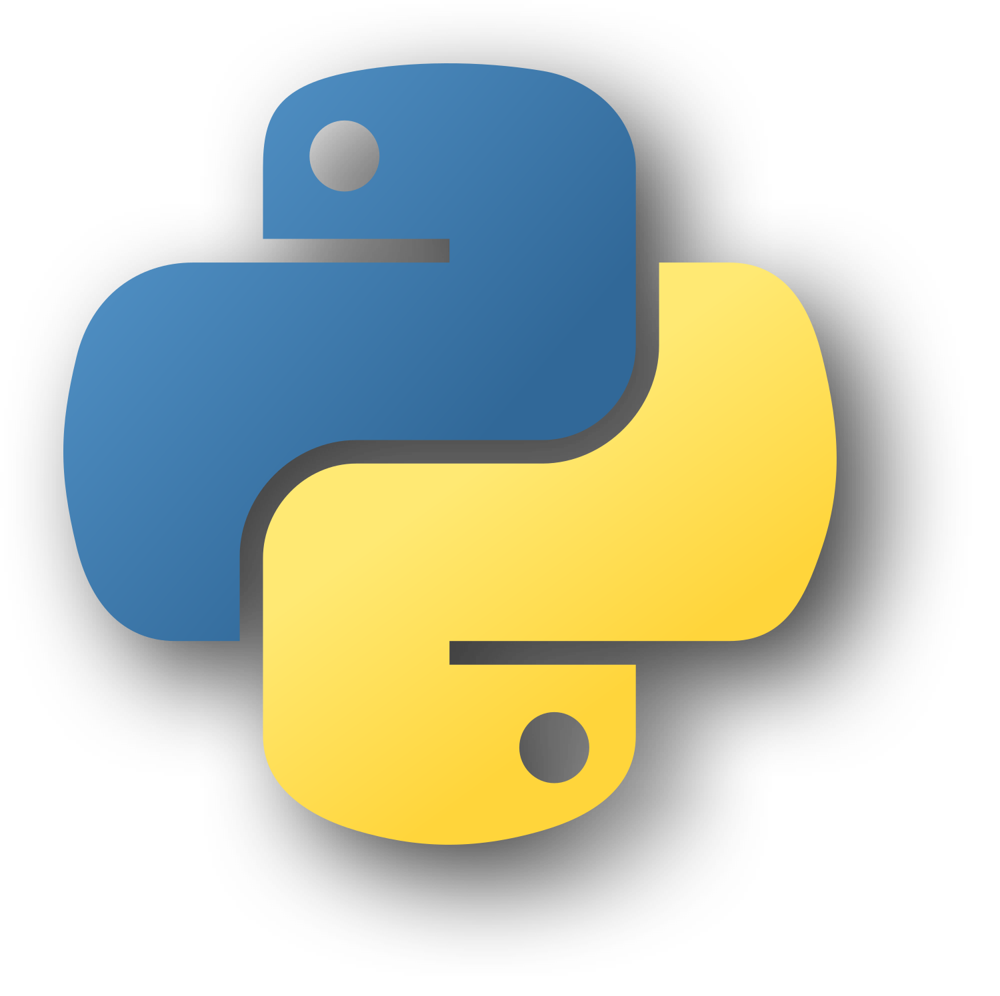
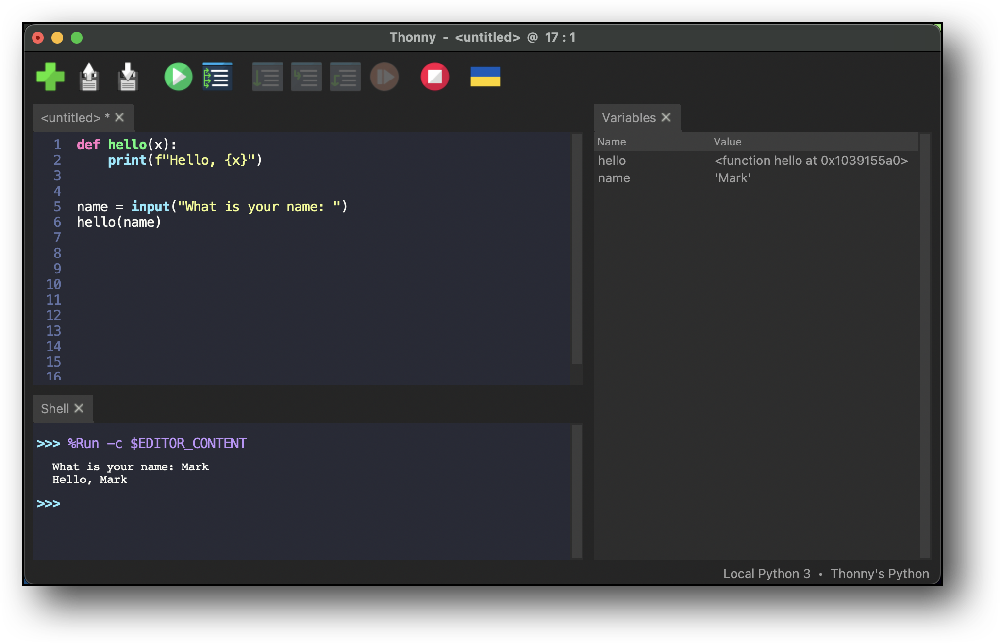

# Oakridge Python Training  

## Week 1  
1. Introduction to programming languages.  
2. Setting up th integrated development enviroment.  
3. Writing your first program.  
4. Introduction to the Raspberry Pi Pico.  

### What is a programming languages?  
- Programming languages are used to explain to a computer how to do 
something.  
- Programming languages allow programmers to give instructions to a 
computer to do a task.  
- There are two main types of programming languages, **visual** and 
**textual**.  
-  is a visual programming language  

Here are some textual languages:
<center>
    
    
    
    
</center>

### Which programming Language should you learn?
- The most popular?
- The easiest?
- The hardest?

It depends on what kind of program you want to write. Each programming 
language is good at something different. Once you learn one it is easy 
to learn a second.

The main difference between them is **syntax**!

### What is Syntax?
All of the following programs do the same thing, but they are writing in 
different languages.

C:
```C
#include <stdio.h>

int main()
{
    printf("Hello World\n");
    return 0;
}
```
C++:
```cpp
#include <iostream>
using namespace std;

int main()
{
    cout << "Hello World\n";
    return 0;
}
```
JavaScript:
```js
console.log("Hello World");
```
Python:
```python
print("Hello World")
```
Each of the above programs prints `Hello World`.

### What is an IDE?

- Integrated Development Environment
- **Thonny** is a Python IDE for Beginners that we will 
be using today.

1. Open **Thonny**
2. Go to **View** in the menu bar and select **Variable**

